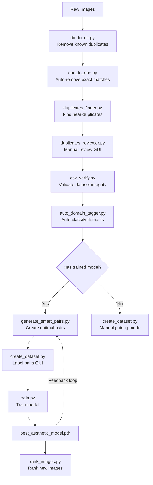

# AniFeatures - AI-Powered Image Aesthetic Scoring System

AniFeatures is a comprehensive pipeline for training an aesthetic scoring model using preference learning. The system uses a Siamese network architecture to learn from pairwise image comparisons (A-vs-B preferences), enabling accurate ranking of images based on their visual quality and appeal.

## How It Works

The project implements a **preference-based learning** approach:

1. **Duplicate Detection & Removal**: Clean your dataset by finding and removing duplicate or near-duplicate images using perceptual hashing
2. **Domain Classification**: Automatically classify images into 4 domains (Reality, 2D Illust, 3D Render, Pixel Art) using OpenCLIP
3. **Smart Pair Generation**: Use a trained model to score unlabeled images and create optimal comparison pairs
4. **Dataset Creation**: Label image pairs through an intuitive GUI interface
5. **Model Training**: Train a Siamese network with domain-specific embeddings using Margin Ranking Loss
6. **Image Ranking**: Rank new images using the trained model

### Architecture Overview



## Installation

### Prerequisites

- Python 3.10+
- CUDA-capable GPU (recommended for training)
- pip or uv package manager

### Setup Steps

#### 1. Clone the Repository

```bash
git clone https://github.com/scikous/AniFeatures.git
cd AniFeatures
```

#### 2. Create a Virtual Environment

```bash
# Using venv
python -m venv venv
source venv/bin/activate  # On Windows: venv\Scripts\activate

# Using UV
uv venv --python 3.10 .venv
source .venv/bin/activate
```

#### 3. Install Dependencies

```bash
# Using UV
uv sync

# Using pip
pip install -r requirements.txt
```

Core dependencies include:
- `torch` - PyTorch for deep learning
- `timm` - Vision Transformer models (ViT backbone)
- `open_clip_torch` - OpenCLIP for domain classification
- `Pillow` - Image processing
- `imagehash` - Perceptual hashing for duplicate detection
- `pandas` - Data handling
- `numpy` - Numerical operations

## Complete Workflow

Follow these steps in order to process your image dataset and train the aesthetic scoring model.

### Step 1: Remove Known Duplicates (dir_to_dir.py)

Compare a reference directory against your target directory and remove matching images from the target. This prevents known duplicates from entering your dataset.

```bash
# Example
python duplicates_tools/dir_to_dir.py \
    --reference_dir ./dataset/images \
    --target_dir ./dataset/all_images \
    [--dry-run]  # Preview deletions without executing
```

**How it works:**
- Computes perceptual hashes (pHash) for all images in both directories
- Matches images with identical or near-identical hashes
- Deletes matching images from the target directory
- Uses multiprocessing for fast processing
- Maintains a hash cache (`image_hashes.json`) to avoid recomputation

**Parameters:**
- `--reference_dir`: Directory containing known duplicates to exclude
- `--target_dir`: Directory to clean (images will be deleted here)
- `--dry-run`: Show what would be deleted without actually deleting
- `--threshold`: Hash similarity threshold (default: 0, exact match only)

---

### Step 2: Auto-Remove Exact Duplicates (one_to_one.py)

Automatically find and remove duplicate images within a single directory. This script intelligently keeps the best copy (largest file size with shortest path).

```bash
# Example
python duplicates_tools/one_to_one.py \
    --input_dir ./dataset/all_images \
    [--dry-run]
```

**How it works:**
- Groups images by perceptual hash similarity
- For each group, keeps the largest file with the shortest path
- Deletes all other copies automatically
- Uses Union-Find algorithm for efficient grouping

**Parameters:**
- `--input_dir`: Directory to scan and clean
- `--dry-run`: Preview deletions without executing
- `--threshold`: Hash similarity threshold (default: 0)

---

### Step 3: Find Near-Duplicates (duplicates_finder.py)

Detect groups of similar images without deleting them. This creates a JSON file for manual review.

```bash
# Example
python duplicates_tools/duplicates_finder.py \
    --input_dir ./dataset/all_images \
    [--threshold 10] \
    [--output_file duplicates.json]
```

**Output:** `duplicates.json` - An array of arrays, where each inner array contains paths to similar images:

```json
[
    ["./dataset/all_images/img1.jpg", "./dataset/all_images/img2.jpg"],
    ["./dataset/all_images/img3.png", "./dataset/all_images/img4.png", "./dataset/all_images/img5.jpg"]
]
```

**Parameters:**
- `--input_dir`: Directory to scan for duplicates
- `--threshold`: Higher values (0-16) allow more bit differences in hashes (default: 0)
- `--output_file`: Output JSON file path (default: `duplicates.json`)

---

### Step 4: Manual Duplicate Review (duplicates_reviewer.py)

Interactive GUI for reviewing duplicate groups and deciding which images to keep.

```bash
python duplicates_tools/duplicates_reviewer.py \
    --input_file duplicates.json
```

**Features:**
- **Whitelist Group**: Mark entire group as acceptable (e.g., intentional variations)
- **Keep Selected**: Keep the currently selected image, move others to trash folder
- **Move to Trash**: Manually move images to `./dataset/trash/`
- Keyboard shortcuts for rapid navigation

**Output:**
- Whitelisted groups saved to `duplicate_whitelist.json`
- Moved files relocated to `./dataset/trash/` subdirectories

---

### Step 5: Verify Dataset Integrity (csv_verify.py)

Validate that your dataset CSV file matches the actual images on disk. This catches broken references and missing files before training.

```bash
python csv_verify.py \
    --csv_filepath ./labels.csv
```

**Checks performed:**
1. **CSV → Directory**: Verifies all images listed in CSV exist on disk
2. **Directory → CSV**: Finds images in directory that are not referenced in CSV

**Output Example:**
```
=== Checking Dataset Integrity ===
Checking: labels.csv

Images in CSV but missing from directory: 0
Images in directory but missing from CSV: 3
  - ./dataset/all_images/orphan1.jpg
  - ./dataset/all_images/orphan2.png
  - ./dataset/all_images/orphan3.webp

Dataset integrity: PASSED (with warnings)
```

---

### Step 6: Automatic Domain Classification (auto_domain_tagger.py)

Automatically classify unlabeled images into one of four domains using OpenCLIP ViT-H-14 model.

**Domain Classes:**
| ID | Domain      | Description                          |
|----|-------------|--------------------------------------|
| 0  | Reality     | Real photographs, live-action        |
| 1  | 2D Illust   | Hand-drawn or digital 2D illustrations |
| 2  | 3D Render   | CGI, 3D rendered images              |
| 3  | Pixel Art   | Pixel art style images               |

```bash
# Example
python auto_domain_tagger.py \
    --input_dir ./dataset/all_images \
    [--batch_size 16]
```

**Output:** `domain_map_auto.json` - Maps image paths to domain IDs:

```json
{
    "./dataset/all_images/img1.jpg": 0,
    "./dataset/all_images/img2.png": 1,
    "./dataset/all_images/img3.webp": 2
}
```

**Parameters:**
- `--input_dir`: Directory containing images to classify (default: `./dataset/all_images`)
- `--batch_size`: Number of images to process per forward pass (default: 16)
- `--device`: Override device selection (auto-detects CUDA/MPS/CPU by default)

**How it works:**
- Loads pre-trained OpenCLIP ViT-H-14 model
- Uses text prompts for each domain class
- Computes image-text similarity scores
- Assigns domain with highest similarity score
- Processes images in batches for efficiency
- Skips already-labeled images from `domain_map.json`

---

### Step 7: Generate Smart Pairs (generate_smart_pairs.py) [OPTIONAL]

**Requires:** A previously trained model (`best_aesthetic_model.pth`)

Use the trained model to score unlabeled images and create optimal comparison pairs. This step significantly improves labeling efficiency by pairing similar-quality images, which provides more informative training signals.

```bash
# Example
python generate_smart_pairs.py \
    --model_path ./models/best_aesthetic_model.pth \
    [--input_dir ./dataset/all_images] \
    [--output_file ./smart_pairs_queue.csv] \
    [--num_pairs 1000]
```

**Output:** `smart_pairs_queue.csv` - CSV file with image pairs:

```csv
img1,img2
./dataset/all_images/img1.jpg,./dataset/all_images/img2.png
./dataset/all_images/img3.webp,./dataset/all_images/img4.jpg
```

**How it works:**
1. Loads the trained aesthetic scoring model
2. Scores all unlabeled images using auto-detected domains
3. Sorts images by score and pairs adjacent images (similar quality)
4. Excludes already-labeled images from `labels.csv`
5. Generates specified number of pairs for labeling

**Parameters:**
- `--model_path`: Path to trained model weights (default: `./models/best_aesthetic_model.pth`)
- `--input_dir`: Directory with unlabeled images (default: `./dataset/all_images`)
- `--output_file`: Output CSV path (default: `./smart_pairs_queue.csv`)
- `--num_pairs`: Number of pairs to generate (default: 1000)

**Why Smart Pairing?**
Pairing similar-quality images creates harder, more informative comparisons. Easy pairs (obviously good vs. obviously bad) provide less gradient signal than close calls where the model needs to learn subtle differences.

---

### Step 8: Create & Label Dataset (create_dataset.py)

Multi-phase GUI application for dataset creation and pairwise labeling.

```bash
python create_dataset.py
```

The application runs in three phases:

#### Phase 1: Domain Classification

Manually classify unlabeled images into the 4 domains. This phase processes images not yet in `domain_map.json`.

**Interface:**
- Displays one image at a time
- Four buttons for domain selection (Reality, 2D Illust, 3D Render, Pixel Art)
- Delete button to remove unwanted images
- Keyboard shortcuts: `1`, `2`, `3`, `4` for domains, `Del` for delete

**Output:** Updates `domain_map.json` with classifications

#### Phase 2: Clash Resolution (if needed)

Handles filename conflicts between source directory and processed directory.

**Options per conflict:**
- **Delete New**: Remove the duplicate from source
- **Rename New**: Add suffix to keep both versions
- **Whitelist New**: Mark as acceptable duplicate

#### Phase 3: Pairwise Labeling

Label image pairs by comparing them and indicating preference.

**Input:** `smart_pairs_queue.csv` (from Step 7) or manual pairing mode

**Interface:**
- Side-by-side image comparison
- Domain selectors for each image (auto-filled from domain maps)
- Label buttons: "Left Better", "Right Better", "Equal"
- Keyboard shortcuts: `←` (left), `→` (right), `=` (equal), `Del` (delete image)

**Output:** `labels.csv` with format:

```csv
image1_path,image2_path,domain1,domain2,label
./dataset/all_images/img1.jpg,./dataset/all_images/img2.png,1,0,1.0
./dataset/all_images/img3.webp,./dataset/all_images/img4.jpg,2,2,-1.0
```

**Label Values:**
- `1`: First image is better
- `-1`: Second image is better
---

### Step 9: Train the Model (train.py)

Train the aesthetic scoring model using your labeled dataset.

```bash
# Example
python train.py \
    --labels_csv ./labels.csv \
    [--epochs 50] \
    [--batch_size 32] \
    [--learning_rate 1e-4] \
    [--model_name vit_large_patch14_dinov2.lvd142m] \
    [--output_path ./models/best_aesthetic_model.pth]
```

**Training Features:**
- **Architecture**: Siamese network with ViT backbone + domain embeddings
- **Loss Function**: Margin Ranking Loss (margin=0.2)
- **Optimizer**: AdamW with cosine annealing scheduler
- **Mixed Precision**: Automatic mixed precision (AMP) for faster training
- **Early Stopping**: Patience-based early stopping with model checkpointing
- **Domain Embeddings**: Learnable embeddings per domain for domain-specific scoring

**Parameters:**
- `--labels_csv`: Path to labeled pairs CSV (required)
- `--epochs`: Number of training epochs (default: 50)
- `--batch_size`: Training batch size (default: 32)
- `--learning_rate`: Initial learning rate (default: 1e-4)
- `--model_name`: TIMM model name for ViT backbone (default: `vit_large_patch14_dinov2.lvd142m`)
- `--dropout_rate`: Dropout probability (default: 0.0)
- `--num_domains`: Number of domain classes (default: 4)
- `--domain_dim`: Dimension of domain embeddings (default: 32)
- `--margin`: Margin for MarginRankingLoss (default: 0.2)
- `--early_stopping_patience`: Epochs without improvement before stopping (default: 10)
- `--output_path`: Path to save best model (default: `./models/best_aesthetic_model.pth`)
- `--device`: Override device selection (auto-detects CUDA/MPS/CPU)

**Training Output:**
```
=== Training Configuration ===
Device: cuda
Model: vit_large_patch14_dinov2.lvd142m
Dataset size: 5000 pairs
Batch size: 32
Epochs: 50
Learning rate: 0.0001

--- Epoch 1/50 ---
  Train Loss: 0.4523 | Val Loss: 0.4312 | Val Accuracy: 68.5%
  → New best model saved!

...

=== Training Complete ===
Best validation accuracy: 78.3% at epoch 23
Model saved to: ./models/best_aesthetic_model.pth
```

---

### Step 10: Rank Images (rank_images.py)

Use the trained model to rank and score new images.

```bash
# Example
python rank_images.py \
    --model_path ./models/best_aesthetic_model.pth \
    [--image_dir ./dataset/all_images] \
    [--domain_map ./domain_map.json] \
    [--top_k 50] \
    [--display]
```

**Features:**
- **Auto Domain Detection**: Automatically detects domain for unmapped images using OpenCLIP
- **Batch Scoring**: Efficiently scores all images in directory
- **Visual Display**: Optional GUI showing top-ranked images with score bars
- **Sorted Output**: Prints ranked list with scores and domains

**Output Example:**
```
=== Top 50 Ranked Images ===
Rank | Score    | Domain     | Image Path
-----|----------|------------|----------------------------------
1    | 8.7234   | Reality    | ./dataset/all_images/best.jpg
2    | 8.6891   | 2D Illust  | ./dataset/all_images/illustration.png
3    | 8.5432   | 3D Render  | ./dataset/all_images/render.webp
...

Top 10 images displayed in GUI window.
```

**Parameters:**
- `--model_path`: Path to trained model (required)
- `--image_dir`: Directory of images to rank (default: `./dataset/all_images`)
- `--domain_map`: Path to domain mapping JSON (optional, auto-detects if missing)
- `--top_k`: Number of top images to display (default: 50)
- `--display`: Show GUI with top-ranked images
- `--device`: Override device selection

---

## File Formats Reference

### duplicates.json
```json
[
    ["path/to/img1.jpg", "path/to/img2.jpg"],
    ["path/to/img3.png", "path/to/img4.png", "path/to/img5.webp"]
]
```
Array of duplicate groups. Each group contains paths to similar images.

### domain_map.json / domain_map_auto.json
```json
{
    "./dataset/all_images/image1.jpg": 0,
    "./dataset/all_images/image2.png": 1
}
```
Maps image paths (relative to project root) to domain IDs (0-3).

### labels.csv
```csv
image1_path,image2_path,domain1,domain2, label
./path/to/img1.jpg,./path/to/img2.png,1,0,1.0
```
Pairwise comparison labels:
- `img1`, `img2`: Paths to compared images
- `label`: 1 (left better), -1 (right better)
- `domain1`, `domain2`: Domain IDs for each image

### smart_pairs_queue.csv
```csv
img1,img2
./path/to/img1.jpg,./path/to/img2.png
```
Pre-generated pairs ready for labeling.

### duplicate_whitelist.json
```json
[
    ["./path/to/group1_img1.jpg", "./path/to/group1_img2.jpg"]
]
```
Groups marked as acceptable (not true duplicates).

---

## Configuration Tips

### Duplicate Detection Thresholds

The `--threshold` parameter controls hash similarity:
- **0**: Exact matches only (identical hashes)
- **1-5**: Very similar images (slight modifications, compression artifacts)
- **6-10**: Moderately similar (cropped, resized, filtered versions)
- **11-16**: Loosely similar (same image with significant edits)

**Recommendation:** Start with threshold=0 for Step 2, then use threshold=5-10 for Step 3.

### Domain Classification Accuracy

Auto-classification is typically 85-95% accurate. For best results:
1. Run `auto_domain_tagger.py` first
2. Use `create_dataset.py` Phase 1 to correct misclassifications
3. Review borderline cases during pairwise labeling

### Training Hyperparameters

**Default configuration (works well for most datasets):**
```bash
python train.py \
    --epochs 50 \
    --batch_size 32 \
    --learning_rate 1e-4 \
    --early_stopping_patience 10
```

**For larger datasets (>10k pairs):**
- Increase `--epochs` to 75-100
- Consider larger `--batch_size` if GPU memory allows (64, 128)

**For smaller datasets (<1k pairs):**
- Reduce `--epochs` to 25-30
- Add data augmentation if overfitting occurs
- Use lower `--learning_rate` (1e-5) for fine-tuning

### Smart Pairing Strategy

Smart pairing works best when:
- You have a reasonably trained model (at least one full training run)
- You're labeling a large batch of new images (>500 pairs)
- You want to maximize information per label

For initial dataset creation or small batches, manual random pairing may be sufficient.

---

## Troubleshooting

### GPU Memory Issues

If you encounter CUDA out-of-memory errors:
1. Reduce `--batch_size` in training (try 16 or 8)
2. Use a smaller model: `--model_name vit_base_patch14_dinov2.lvd142m`
3. Enable gradient checkpointing (modify `train.py`)

### Slow Hash Computation

For large directories (>50k images):
- Hash computation is cached in `image_hashes.json`
- Subsequent runs will be much faster
- Use `--threshold 0` for fastest exact matching

### Domain Classification Errors

If auto-classification seems inaccurate:
1. Check image formats (some formats may not load correctly)
2. Verify images are not corrupted
3. Increase batch size consistency (power of 2 recommended)
4. Manually correct using `create_dataset.py` Phase 1

### Model Not Improving

If training loss doesn't decrease:
1. Check label quality (noisy labels hurt performance)
2. Verify domain classifications are correct
3. Try different learning rate (1e-3 or 1e-5)
4. Ensure sufficient dataset diversity (>500 pairs recommended minimum)

---

## Project Structure

```
AniFeatures/
├── README.md                      # This file
├── pyproject.toml                 # Dependencies
├── train.py                       # Model training script
├── rank_images.py                 # Inference/ranking script
├── auto_domain_tagger.py          # Automatic domain classification
├── create_dataset.py              # Dataset creation GUI
├── csv_verify.py                  # CSV validation tool
├── generate_smart_pairs.py        # Smart pair generation
├── duplicates_tools/              # Duplicate detection utilities
│   ├── dir_to_dir.py             # Compare two directories
│   ├── one_to_one.py             # Auto-remove duplicates in directory
│   ├── duplicates_finder.py      # Find duplicate groups (JSON output)
│   ├── duplicates_reviewer.py    # GUI for reviewing duplicates
│   └── hash_manager.py           # Perceptual hashing utilities
├── dataset/                       # Data directories
│   ├── all_images/               # Main image repository
│   ├── all_images_backup/        # Backup of original images
│   ├── trash/                    # Deleted/moved images
│   └── [other subdirectories]    # Organized image collections
├── models/                        # Trained model checkpoints
│   └── best_aesthetic_model.pth  # Best performing model
├── domain_map.json               # Manual domain classifications
├── domain_map_auto.json          # Auto-generated domain map
├── labels.csv                    # Labeled pairwise comparisons
├── smart_pairs_queue.csv         # Generated pairs for labeling
├── duplicates.json               # Detected duplicate groups
├── duplicate_whitelist.json      # Whitelisted duplicate groups
└── image_hashes.json             # Cached perceptual hashes
```